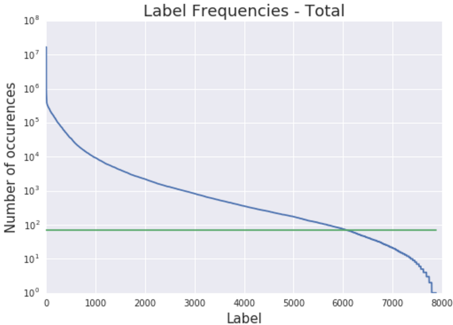
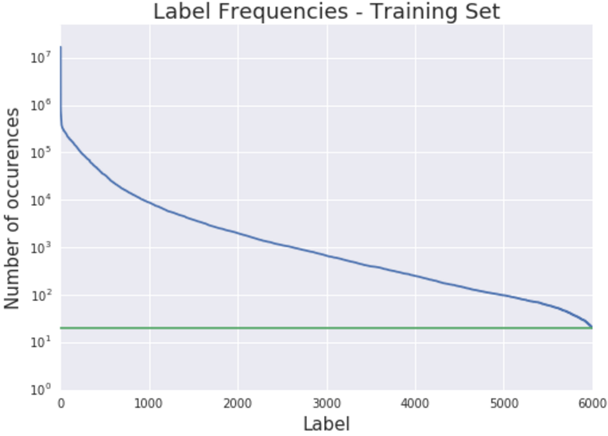
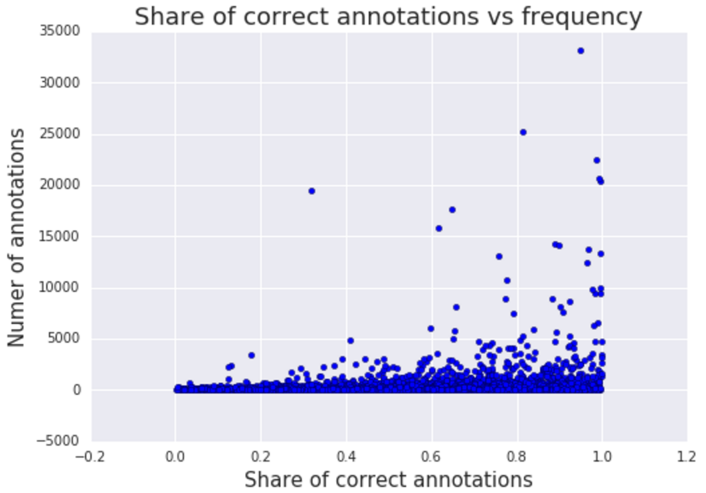

# Open Images dataset

Open Images is a dataset of ~9 million URLs to images that have been annotated with labels spanning over 6000 categories.

The annotations are licensed by Google Inc. under [CC BY 4.0](https://creativecommons.org/licenses/by/4.0/) license. The contents of this repository are released under an [Apache 2](LICENSE) license.

The images are listed as having a [CC BY 2.0](https://creativecommons.org/licenses/by/2.0/) license. **Note:** while we tried to identify images that are licensed under a Creative Commons Attribution license, we make no representations or warranties regarding the license status of each image and you should verify the license for each image yourself.

## Goodies
- **New** [OpenImages annotations on BigQuery](https://cloud.google.com/bigquery/public-data/openimages)

- [Unofficial dataset viewer](http://openimages.oldjpg.com/) by [tzatter](https://github.com/tzatter).

## Download the data

* [Image URLs and metadata](https://storage.googleapis.com/openimages/2016_08/images_2016_08_v5.tar.gz) (990 MB) -- **updated**: added OriginalSize and OriginalMD5 and Thumbnail300KURL columns.
* [Machine image-level annotations (train and validation sets)](https://storage.googleapis.com/openimages/2016_08/machine_ann_2016_08_v3.tar.gz) (450 MB)
* [Human image-level annotations (validation set)](https://storage.googleapis.com/openimages/2016_08/human_ann_2016_08_v3.tar.gz) (9 MB)

See also how to [import the annotations into PostgreSQL](https://github.com/openimages/dataset/wiki/Importing-into-PostgreSQL).

## Data organization

Each image has a unique 64-bit ID assigned. In the CSV files they appear as zero-padded hex integers, such as 000060e3121c7305. The dataset is split into a training set (9011219 images) and a validation set (167057 images). Each image has zero, one or more image-level labels assigned. Both sets have machine-populated annotations, while the validation set also has human annotations. The raters have been asked to validate the machine annotations, which allowed to practically eliminate false positive from the validation set (but not false negatives).

Labels are so called mids as can be found in [Freebase](https://en.wikipedia.org/wiki/Freebase) or [Google Knowledge Graph API](https://developers.google.com/knowledge-graph/). A short description of each label is available in [dict.csv](dict.csv). There are 7844 distinct labels attached to at least one images, but only around 6000 labels are considered 'trainable' with at least 50 images in the validation set and at least 20 images in the training set.

Each annotation has a confidence number from 0.0 to 1.0 assigned. The human annotations are definite (either positive, 1.0 or negative, 0.0), while machine annotations have fractional confidences, generally, >= 0.5. The higher confidence, the smaller chance for the label to be a false positive.

The data tarballs contain CSV files of two types:

### images.csv

There's one such file for each subset inside train and validation subdirectories. It has image URLs, their OpenImages IDs, titles, authors and license information:

```
ImageID,Subset,OriginalURL,OriginalLandingURL,License,AuthorProfileURL,Author,Title,\
OriginalSize,OriginalMD5,Thumbnail300KURL
...

000060e3121c7305,train,https://c1.staticflickr.com/5/4129/5215831864_46f356962f_o.jpg,\
https://www.flickr.com/photos/brokentaco/5215831864,\
https://creativecommons.org/licenses/by/2.0/,\
"https://www.flickr.com/people/brokentaco/","David","28 Nov 2010 Our new house."\
211079,0Sad+xMj2ttXM1U8meEJ0A==,https://c1.staticflickr.com/5/4129/5215831864_ee4e8c6535_z.jpg
```

The data is as it appears on the destination websites.

* OriginalSize is the download size of the original image.
* OriginalMD5 is base64-encoded binary MD5, as described [here](https://cloud.google.com/storage/transfer/create-url-list#md5).
* Thumbnail300KURL is an optional URL to a thumbnail with ~300K pixels (~640x480). It's provided for the convenience of downloading the data in the absence of more convenient ways to get the images. If missing, the OriginalURL must be used (and then resized to the same size, if needed). **Beware:** these thumbnails are generated on the fly and their contents and even resolution might be different every day.

### labels.csv

The CSVs of this type attach labels to image IDs:

```
ImageID,Source,LabelName,Confidence
...
000060e3121c7305,machine,/m/06ht1,0.9
000060e3121c7305,machine,/m/05wrt,0.9
000060e3121c7305,machine,/m/01l0mw,0.8
000060e3121c7305,machine,/m/03d2wd,0.7
000060e3121c7305,machine,/m/03nxtz,0.7
000060e3121c7305,machine,/m/023907r,0.7
000060e3121c7305,machine,/m/020g49,0.7
000060e3121c7305,machine,/m/0l7_8,0.6
000060e3121c7305,machine,/m/02rfdq,0.6
000060e3121c7305,machine,/m/038t8_,0.6
000060e3121c7305,machine,/m/03f6tq,0.6
000060e3121c7305,machine,/m/01s105,0.6
000060e3121c7305,machine,/m/01nblt,0.5
...
```

These can be converted to their short descriptions by looking into dict.csv:

```
"/m/05wrt","property"
"/m/06ht1","room"
"/m/01l0mw","home"
"/m/03d2wd","dining room"
"/m/03nxtz","cottage"
"/m/020g49","hardwood"
"/m/023907r","real estate"
"/m/038t8_","estate"
"/m/03f6tq","living room"
"/m/0l7_8","floor"
"/m/01nblt","apartment"
"/m/01s105","cabinetry"
```

## Stats and data quality

The distribution of labels across the images is highly uneven with some labels attached to more than a million images, while others to less than 100:





While the machine annotations are somewhat noisy, in general, the labels with more images are more accurate:




We have trained an Inception v3 model based on Open Images annotations alone, and the model is good enough to be used for fine-tuning applications as well as for other things, like [DeepDream](https://research.googleblog.com/2015/07/deepdream-code-example-for-visualizing.html) or [artistic style transfer](https://arxiv.org/abs/1508.06576) which require a well developed hierarchy of filters. We hope to improve the quality of the annotations in Open Image the coming months, and therefore the quality of models which can be trained.

