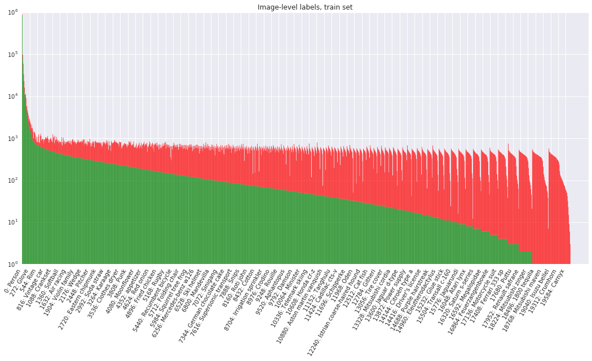
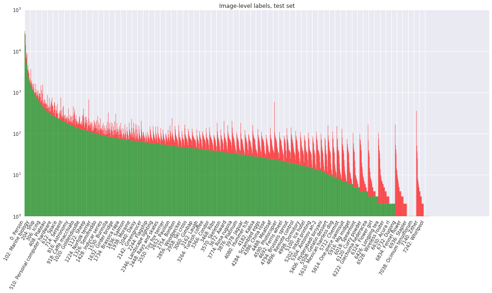
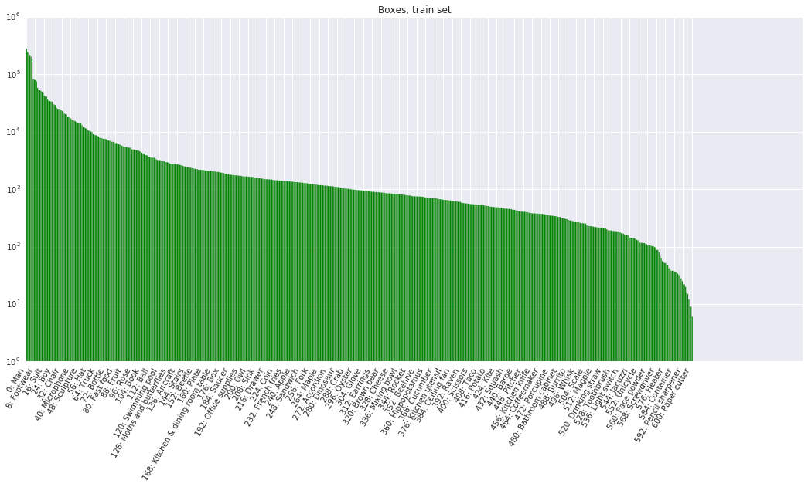
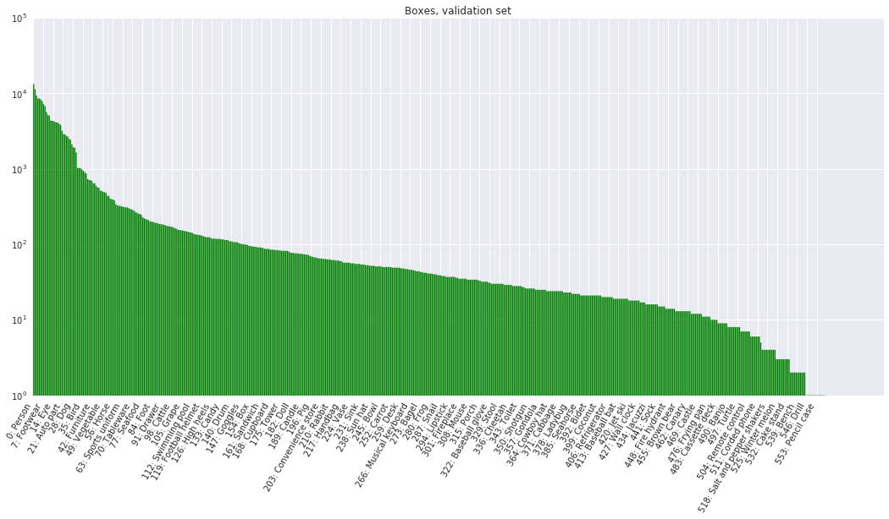
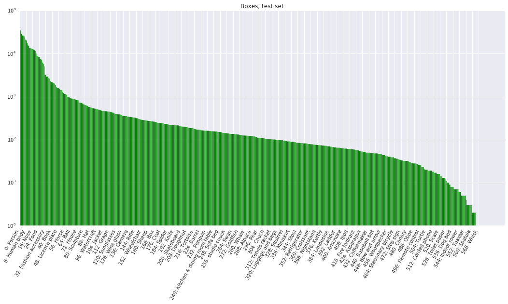

# Open Images Dataset V3

Open Images is a dataset of ~9 million URLs to images that have been annotated with image-level labels and bounding boxes spanning thousands of classes.

The annotations are licensed by Google Inc. under [CC BY 4.0](https://creativecommons.org/licenses/by/4.0/) license. The contents of this repository are released under an [Apache 2](LICENSE) license.

The images are listed as having a [CC BY 2.0](https://creativecommons.org/licenses/by/2.0/) license. **Note:** while we tried to identify images that are licensed under a Creative Commons Attribution license, we make no representations or warranties regarding the license status of each image and you should verify the license for each image yourself.

[](http://www.cvdfoundation.org/datasets/open-images-dataset/vis)
*<sub>Annotated images from the Open Images dataset. Left: [FAMILY MAKING A SNOWMAN](https://www.flickr.com/photos/mwvchamber/5433788065) by [mwvchamber](https://www.flickr.com/photos/mwvchamber/). Right: [STANZA STUDENTI.S.S. ANNUNZIATA](https://www.flickr.com/photos/ersupalermo/5759830290) by [ersupalermo](https://www.flickr.com/photos/ersupalermo/). Both images used under [CC BY 2.0](https://creativecommons.org/licenses/by/2.0/) license.<br><b>Browse the validation set [here](http://www.cvdfoundation.org/datasets/open-images-dataset/vis) and the train set [here](http://www.cvdfoundation.org/datasets/open-images-dataset/vis?set=train)</b>, courtesy of Common Visual Data Foundation ([CVDF](http://www.cvdfoundation.org)).</sub>*

## Announcements

* **11-20-2017** Inception resnet v2 object detection model released (trained on V2 data). [Model checkpoint](https://github.com/tensorflow/models/blob/master/research/object_detection/g3doc/detection_model_zoo.md), [evaluation protocol](https://github.com/tensorflow/models/blob/master/research/object_detection/g3doc/evaluation_protocols.md), and [inference and evaluation tools](https://github.com/tensorflow/models/blob/master/research/object_detection/g3doc/oid_inference_and_evaluation.md) are available as part of the [Tensorflow Object Detection API](https://github.com/tensorflow/models/tree/master/research/object_detection).
* **11-16-2017** All images can now be easily [downloaded](https://github.com/cvdfoundation/open-images-dataset) from the Common Visual Data Foundation!
* **11-16-2017** V3 data released! The dataset now includes 3.7M bounding-boxes and 9.7M positive image-level labels on the training set.
* **10-20-2017** Resnet 101 image classification model released (trained on V2 data). [Model checkpoint](https://storage.googleapis.com/openimages/2017_07/oidv2-resnet_v1_101.ckpt.tar.gz), [Checkpoint readme](https://storage.googleapis.com/openimages/2017_07/oidv2-resnet_v1_101.readme.txt), [Inference code](tools/classify_oidv2.py).
* **07-20-2017** V2 data is released! The dataset now includes 2M bounding boxes spanning 600 object classes (1.24M in train, 830K in validation+test), and 4.3M human-verified positive image-level labels on the training set. [Changelist](CHANGELIST-V1-TO-V2.md). Coming soon: Trained models (both image-level and object detectors).
* **07-20-2017** [V2 data visualizer](http://www.cvdfoundation.org/datasets/open-images-dataset/vis), courtesy of Common Visual Data Foundation ([CVDF](http://www.cvdfoundation.org)).

## Download the data

* [Images](https://github.com/cvdfoundation/open-images-dataset): packaged for easy download from the Common Visual Data Foundation
* [Image URLs and metadata](https://storage.googleapis.com/openimages/2017_11/images_2017_11.tar.gz) (990 MB)
* [Bounding box annotations (train, validation, and test sets)](https://storage.googleapis.com/openimages/2017_11/annotations_human_bbox_2017_11.tar.gz) (97 MB)
* [Human-verified image-level annotations (train, validation, and test sets)](https://storage.googleapis.com/openimages/2017_11/annotations_human_2017_11.tar.gz) (137 MB)
* [Machine-generated image-level annotations (train, validation, and test sets)](https://storage.googleapis.com/openimages/2017_11/annotations_machine_2017_11.tar.gz) (447 MB)
* [Classes and class descriptions](https://storage.googleapis.com/openimages/2017_11/classes_2017_11.tar.gz) (295 KB)

See also how to [import the annotations into PostgreSQL](https://github.com/openimages/dataset/wiki/Importing-into-PostgreSQL).

## Data organization

The [dataset](#download-the-data) is split into a training set (9,011,219 images), a validation set (41,620 images), and a test set (125,436 images). The validation of V1 set was partitioned into validation and test in the V2 release. This is intended to make evaluations more tractable. The images are annotated with image-level labels and bounding boxes as described below.

### Image-level labels

Table 1 shows an overview of the image-level labels in all splits of the dataset. All images have image-level labels automatically generated by a computer vision model similar to [Google Cloud Vision API](https://cloud.google.com/vision/). These automatically generated labels have a substantial false positive rate.

<p align='center'>Table 1: Image-level labels.</p>

| | Train | Validation | Test | # Classes | # Trainable Classes |
|---:|---:|---:|---:|---:|---:|
|Images|9,011,219|41,620|125,436|-|-|
|Machine Generated Labels|78,977,695|512,093|1,545,835|7,870|4,966|
|Human Verified Labels|20,868,755<br/>pos: &nbsp;&nbsp;9,741,876<br/>neg: 11,126,879|551,390<br/>pos: 365,772<br/>neg: 185,618|1,667,399<br/>pos: 1,105,052<br/>neg: &nbsp;&nbsp;&nbsp;562,347|19,693|5,000|

Moreover, all images in the validation and test sets as well as part of the training set have human-verified image-level labels. Most of the human verifications have been done with in-house annotators at Google. A smaller part has been done with crowd-sourced verification from Image Labeler: [Crowdsource app](http://play.google.com/store/apps/details?id=com.google.android.apps.village.boond), [g.co/imagelabeler](http://g.co/imagelabeler). This human verification process allows to practically eliminate false positives (but not false negatives, so some labels might be missing from an image). The resulting verified positive labels are largely correct and we recommend to use these for training computer vision models. A variety of computer vision models were used to generate the samples (not just the one used for the machine-generated labels above) which is why the vocabulary is significantly expanded (#classes column in Table 1).

Overall, there are 19,995 distinct [classes with image-level labels](https://storage.googleapis.com/openimages/2017_11/classes.txt) (19,693 have at least one human-verified sample and 7870 have a sample in the machine-generated pool; note that verifications come from both the released machine-generated labels and from internal-only models). Of these, [5000 classes are considered trainable](https://storage.googleapis.com/openimages/2017_11/classes-trainable.txt). The trainable classes are unchanged from V2 (in V2 they were defined to have at least 30 human-verified samples in the training set and 5 in the validation or test sets). Classes are identified by MIDs (Machine-generated Ids) as can be found in [Freebase](https://en.wikipedia.org/wiki/Freebase) or [Google Knowledge Graph API](https://developers.google.com/knowledge-graph/). A short description of each class is available in [class-descriptions.csv](https://storage.googleapis.com/openimages/2017_11/class-descriptions.csv).

Each annotation has a confidence number from 0.0 to 1.0 assigned. Confidences for the human-verified labels are binary (either positive, 1.0 or negative, 0.0). Machine-generated labels have fractional confidences, generally >= 0.5. The higher the confidence, the smaller chance for the label to be a false positive.

### Bounding boxes

Table 2 shows an overview of the bounding box annotations in all splits of the dataset, which span 600 object classes. These offer a broader range than those in the ILSVRC and COCO detection challenges, and include new objects such as fedora hat and snowman.

<p align='center'>Table 2: Boxes.</p>

| | Train | Validation | Test | # Classes | # Trainable Classes |
|---:|---:|---:|---:|---:|---:|
|Images|1,593,853|41,620|125,436|-|-|
|Boxes|3,709,509|204,621|625,282|600|545|

We provide complete bounding box annotation for all object instances on the validation and test sets, all manually drawn by human annotators at Google. This was done for all image-level labels that have been positively verified by a human (see Table 1).  We deliberately tried to annotate boxes at the most specific level in our [semantic hierarchy](https://storage.googleapis.com/openimages/2017_07/bbox_labels_vis/bbox_labels_vis.html) as possible. For example, car has two children limousine and van. All limousines and all vans have been annotated as such, while all other kinds of cars have been annotated as car. Moreover, annotators also marked a set of attributes for each box, e.g. indicating whether that object is occluded. On average, there are about 5 boxes per image in the validation and test sets.

For the training set, we considered annotating boxes in 1.5M images, and focusing on the most specific available positive image-level labels. For example, if an image has labels {car, limousine, screwdriver}, then we consider annotating boxes for limousine and screwdriver. We provide a total of 3.68M bounding boxes. 1.22M of them were drawn manually using the efficient interface described in ["Extreme clicking for efficient object annotation", Papadopolous et al., ICCV 2017](https://arxiv.org/abs/1708.02750). We produced the other 2.46M boxes semi-automatically using an enhanced version of the method described in ["We don't need no bounding-boxes: Training object class detectors using only human verification", Papadopolous et al., CVPR 2016](https://arxiv.org/abs/1602.08405). This process iterates between detecting objects, asking humans to verify the current detections (boxes), and updating the detector. This enables to localize difficult objects that were missed in early iterations. We run it for 3-4 iterations. All boxes have been human verified to have IoU > 0.7 with the perfect box, and in practice they are very accurate (mean IoU around 0.82). We deliberately did not annotate human body parts for 80% of the training set due to the overwhelming number of instances. On average, there are about 2 boxes per image in the training set. In general over the whole training set, if there are multiple objects of the same class in one image, only one has been boxed.

Overall, there are [600 distinct classes with a bounding box](https://storage.googleapis.com/openimages/2017_11/classes-bbox.txt) attached to at least one image. Of these, [545 classes are considered trainable](https://storage.googleapis.com/openimages/2017_11/classes-bbox-trainable.txt) (the intersection of the 600 boxable classes with the 5000 image-level trainable classes).

### Data Formats

The data tarballs contain the following files:

### images.csv

There's one such file for each subset inside train, validation, and test subdirectories respectively. It has image URLs, their OpenImages IDs, titles, authors and license information:

```
ImageID,Subset,OriginalURL,OriginalLandingURL,License,AuthorProfileURL,Author,Title,\
OriginalSize,OriginalMD5,Thumbnail300KURL
...
000060e3121c7305,train,https://c1.staticflickr.com/5/4129/5215831864_46f356962f_o.jpg,\
https://www.flickr.com/photos/brokentaco/5215831864,\
https://creativecommons.org/licenses/by/2.0/,\
"https://www.flickr.com/people/brokentaco/","David","28 Nov 2010 Our new house."\
211079,0Sad+xMj2ttXM1U8meEJ0A==,https://c1.staticflickr.com/5/4129/5215831864_ee4e8c6535_z.jpg
...
```

Each image has a unique 64-bit ID assigned. In the CSV files they appear as zero-padded hex integers, such as 000060e3121c7305.

The data is as it appears on the destination websites.

* OriginalSize is the download size of the original image.
* OriginalMD5 is base64-encoded binary MD5, as described [here](https://cloud.google.com/storage/transfer/create-url-list#md5).
* Thumbnail300KURL is an optional URL to a thumbnail with ~300K pixels (~640x480). It's provided for the convenience of downloading the data in the absence of more convenient ways to get the images. If missing, the OriginalURL must be used (and then resized to the same size, if needed). **Beware:** these thumbnails are generated on the fly and their contents and even resolution might be different every day.

### annotations-machine.csv

Machine-generated image-level labels (one file each for train, validation, and test):

```
ImageID,Source,LabelName,Confidence
000002b66c9c498e,machine,/m/05_4_,0.7
000002b66c9c498e,machine,/m/0krfg,0.7
000002b66c9c498e,machine,/m/01kcnl,0.5
000002b97e5471a0,machine,/m/05_5t0l,0.9
000002b97e5471a0,machine,/m/0cgh4,0.8
000002b97e5471a0,machine,/m/0dx1j,0.8
000002b97e5471a0,machine,/m/039jbq,0.8
000002b97e5471a0,machine,/m/03nfmq,0.8
000002b97e5471a0,machine,/m/03jm5,0.7
...
```

These were generated from a computer vision model similar to
[Google Cloud Vision API](https://cloud.google.com/vision/).

### annotations-human.csv

Human-verified image-level labels (one file each for train, validation, and test):

```
ImageID,Source,LabelName,Confidence
000026e7ee790996,verification,/m/04hgtk,0
000026e7ee790996,verification,/m/07j7r,1
000026e7ee790996,crowdsource-verification,/m/01bqvp,1
000026e7ee790996,crowdsource-verification,/m/0csby,1
000026e7ee790996,verification,/m/01_m7,0
000026e7ee790996,verification,/m/01cbzq,1
000026e7ee790996,verification,/m/01czv3,0
000026e7ee790996,verification,/m/01v4jb,0
000026e7ee790996,verification,/m/03d1rd,0
...
```

The Source column indicates how the annotation was created:

- "verification" are human verified image-level labels.
- "crowdsource-verification" are human verified labels from the Crowdsource app.

### annotations-human-bbox.csv

Human provided labels with bounding box coordinates (one file each for train,
validation, and test).

For the train set labels and box coordinates are provided:

```
ImageID,Source,LabelName,Confidence,XMin,XMax,YMin,YMax
000002b66c9c498e,activemil,/m/0284d,1,0.560250,0.951487,0.696401,1.000000
000002b66c9c498e,activemil,/m/052lwg6,1,0.543036,0.907668,0.699531,0.995305
000002b66c9c498e,activemil,/m/0fszt,1,0.510172,0.979656,0.641628,0.987480
000002b66c9c498e,verification,/m/01mzpv,1,0.018750,0.098438,0.767187,0.892187
000002b66c9c498e,xclick,/m/01g317,1,0.012520,0.195618,0.148670,0.588419
000002b66c9c498e,xclick,/m/0284d,1,0.528951,0.924883,0.676056,0.965571
000002b66c9c498e,xclick,/m/02wbm,1,0.530516,0.923318,0.668232,0.976526
000002b66c9c498e,xclick,/m/052lwg6,1,0.516432,0.928012,0.651017,0.985915
000002b66c9c498e,xclick,/m/0fszt,1,0.525822,0.920188,0.669797,0.971831
...
```

For the validation and test sets additional attributes are also given:

```
ImageID,Source,LabelName,Confidence,XMin,XMax,YMin,YMax,IsOccluded,IsTruncated,IsGroupOf,IsDepiction,IsInside
000026e7ee790996,freeform,/m/07j7r,1,0.071905,0.145346,0.206591,0.391306,0,1,1,0,0
000026e7ee790996,freeform,/m/07j7r,1,0.439756,0.572466,0.264153,0.435122,0,1,1,0,0
000026e7ee790996,freeform,/m/07j7r,1,0.668455,1.000000,0.000000,0.552825,0,1,1,0,0
000062a39995e348,freeform,/m/015p6,1,0.205719,0.849912,0.154144,1.000000,0,0,0,0,0
000062a39995e348,freeform,/m/05s2s,1,0.137133,0.377634,0.000000,0.884185,1,1,0,0,0
0000c64e1253d68f,freeform,/m/07yv9,1,0.000000,0.973850,0.000000,0.043342,0,1,1,0,0
0000c64e1253d68f,freeform,/m/0k4j,1,0.000000,0.513534,0.321356,0.689661,0,1,0,0,0
0000c64e1253d68f,freeform,/m/0k4j,1,0.016515,0.268228,0.299368,0.462906,1,0,0,0,0
0000c64e1253d68f,freeform,/m/0k4j,1,0.481498,0.904376,0.232029,0.489017,1,0,0,0,0
...
```

The attributes have the following definitions:

- IsOccluded: Indicates that the object is occluded by another object in the image.
- IsTruncated: Indicates that the object extends beyond the boundary of the image.
- IsGroupOf: Indicates that the box spans a group of objects (e.g., a bed of flowers or a crowd of people). We asked annotators to use this tag for cases with more than 5 instances which are heavily occluding each other and are physically touching.
- IsDepiction: Indicates that the object is a depiction (e.g., a cartoon or drawing of the object, not a real physical instance).
- IsInside: Indicates a picture taken from the inside of the object (e.g., a car interior or inside of a building).

The Source column indicates how the box was created:

- "freeform" and "xclick" are human drawn boxes.
- "activemil" are boxes human verified to be tight (IoU > 0.7) through an Active MIL process.
- "verification" are boxes human verified to be tight (IoU > 0.7) from an object detection model internal to Google.


### class-descriptions.csv

The label MIDs can be converted to their short descriptions by looking into class-descriptions.csv:

```
...
/m/025dyy,Box
/m/025f_6,Dussehra
/m/025fh,Professor x
/m/025fnn,Savannah Sparrow
/m/025fsf,Stapler
/m/025gg7,Jaguar x-type
/m/02_5h,Figure skating
/m/025_h00,Solid-state drive
/m/025_h88,White tailed prairie dog
/m/025_hbp,Mercury monterey
/m/025h_m,Yellow rumped Warbler
/m/025khl,Spätzle
...
```

Note the presence of characters like commas and quotes. The file follows
standard csv escaping rules. E.g.,

```
/m/02wvth,"Fiat 500 ""topolino"""
/m/03gtp5,Lamb's quarters
/m/03hgsf0,"Lemon, lime and bitters"
```

### classes.txt

The list of 19,995 image-level classes:

```
/m/0100nhbf
/m/0104x9kv
/m/0105jzwx
/m/0105ld7g
/m/0105lxy5
/m/0105n86x
/m/0105ts35
/m/0108_09c
/m/01_097
/m/010dmf
...
```

### classes-trainable.txt

The list of 5000 trainable image-level classes.

### classes-bbox.txt

The list of 600 box-level classes.

### classes-bbox-trainable.txt

The list of 545 trainable box-level classes.

## Statistics and data analysis

### Browse the data

- Browse the bounding box groundtruth [here](http://www.cvdfoundation.org/datasets/open-images-dataset/vis), courtesy of [CVDF](http://www.cvdfoundation.org).

- View the set of boxable labels [here](https://storage.googleapis.com/openimages/2017_07/bbox_labels_vis/bbox_labels_vis.html):

[](https://storage.googleapis.com/openimages/2017_07/bbox_labels_vis/bbox_labels_vis.html)

### Label distribution
The following figures show the distribution of annotations across the dataset. Notice that the class distribution is heavily skewed (note: the y-axis is on a log-scale). Labels are ordered by number of positive examples, then by number of negative examples. Green indicates positive examples while red indicates negatives.








## Trained models

- Inception resnet v2 object detection model (trained on V2 data). [Model checkpoint](https://github.com/tensorflow/models/blob/master/research/object_detection/g3doc/detection_model_zoo.md), [evaluation protocol](https://github.com/tensorflow/models/blob/master/research/object_detection/g3doc/evaluation_protocols.md), and [inference and evaluation tools](https://github.com/tensorflow/models/blob/master/research/object_detection/g3doc/oid_inference_and_evaluation.md) are available as part of the [Tensorflow Object Detection API](https://github.com/tensorflow/models/tree/master/research/object_detection).
- Resnet 101 image classification model (trained on V2 data): [Model checkpoint](https://storage.googleapis.com/openimages/2017_07/oidv2-resnet_v1_101.ckpt.tar.gz), [Checkpoint readme](https://storage.googleapis.com/openimages/2017_07/oidv2-resnet_v1_101.readme.txt), [Inference code](tools/classify_oidv2.py).

## Community Contributions

* The team at [Algorithmia](https://algorithmia.com/) created an [in-depth object detection tutorial](https://blog.algorithmia.com/deep-dive-into-object-detection-with-open-images-using-tensorflow/) that walks through how to use the provided bounding box annotations to create a useful object detection model with Tensorflow.

* Dan Nuffer offers helper code to retrieve the images at [Open Images dataset downloader](https://github.com/dnuffer/open_images_downloader). It is a program built for downloading, verifying and resizing the images and metadata. It is designed to run as fast as possible by taking advantage of the available hardware and bandwidth by using asynchronous I/O and parallelism.

NOTE: While we tried to identify images that are licensed under a Creative Commons Attribution license, we make no representations or warranties regarding the license status of each image and you should verify the license for each image yourself.

## Citations

If you use the OpenImages dataset in your work, please cite it as:

APA-style citation: "Krasin I., Duerig T., Alldrin N., Ferrari V., Abu-El-Haija S., Kuznetsova A., Rom H., Uijlings J., Popov S., Veit A., Belongie S., Gomes V., Gupta A., Sun C., Chechik G., Cai D., Feng Z., Narayanan D., Murphy K. OpenImages: A public dataset for large-scale multi-label and multi-class image classification, 2017. Available from https://github.com/openimages".

BibTeX
```
@article{openimages,
  title={OpenImages: A public dataset for large-scale multi-label and multi-class image classification.},
  author={Krasin, Ivan and Duerig, Tom and Alldrin, Neil and Ferrari, Vittorio and Abu-El-Haija, Sami and Kuznetsova, Alina and Rom, Hassan and Uijlings, Jasper and Popov, Stefan and Veit, Andreas and Belongie, Serge and Gomes, Victor and Gupta, Abhinav and Sun, Chen and Chechik, Gal and Cai, David and Feng, Zheyun and Narayanan, Dhyanesh and Murphy, Kevin},
  journal={Dataset available from https://github.com/openimages},
  year={2017}
}
```
